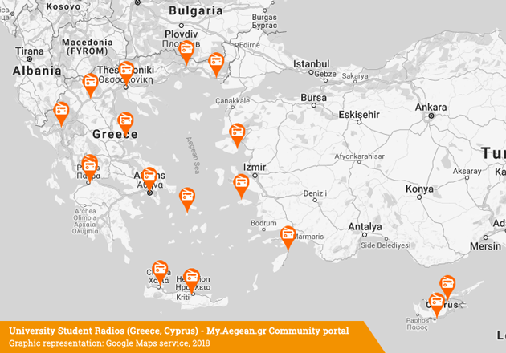
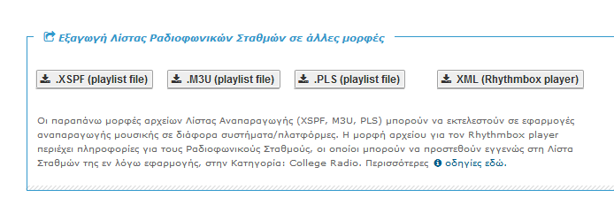

uni-radio-stations
===========

Catalogue for College/University Radio Stations

---------------------------------------

## About the Catalogue for College/University Radio Stations

### A list for College/University Radios in Greece, Cyprus and other Countries

This is a side-project of My.Aegean.gr initiative of the University of the Aegean, Greece. We try to gather info and collaborate in building a rich list of College/University Radio Stations. This is a volunteering project with a non-profit scope.

Station list builds a webpage of a Catalogue and a Maps embeddable webpage as well. We also build some custom mini-players for creating a webring of all radio stations, offering an easy access for listeners to get to them. We try to keep information up-to-date and accurate, for everyone to access it and we hope we can expand the list of stations for other countries as well. Feel free to help us! Thank you! :)

### Easy listening on any media player via ready-to-use playlist-type formats

Station list is also exported to a variety of formats, such as playlist files (.PLS, .M33U, .XSPF) or they are available for listening on supported media players (client applications) that can support streams from Icecast (YP) Stream Directory too.

 

---------------------------------------

## About MyAegean

The idea of <em>"my Aegean"</em> originated in 2002 with a group of students from the University of the Aegean. The aim of this initiative was to create a network portal for the whole of the Aegean University community by utilising any available technology. Our aspiration is to create <strong>a vehicle which will encourage and promote direct, collective and qualitative communication and information exchange, without geographical restrictions, among all members of the Aegean community</strong> (students, academic and research staff, as well as administrative, technical or other personnel). <em>myAegean</em> is to serve as a common point of reference, as a scheme which will stimulate and facilitate interaction among all the members of the university.

## Support

