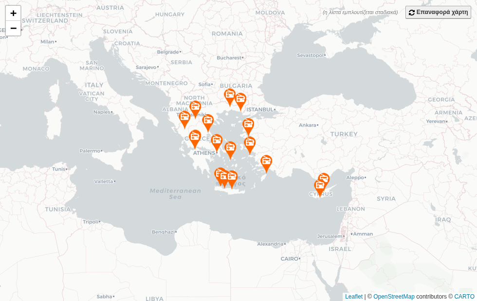
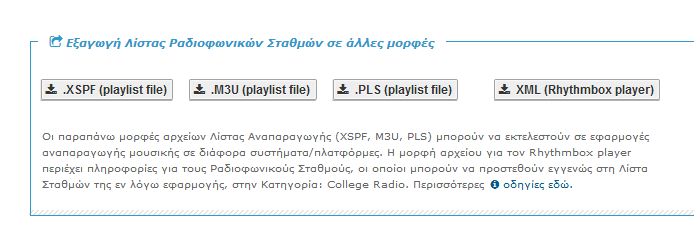
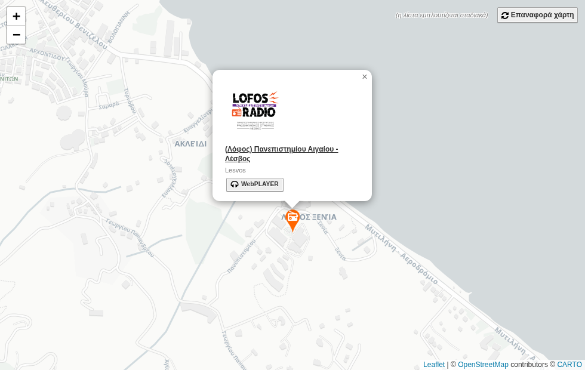

uni-radio-stations
===========

Catalogue for College/University Radio Stations

---------------------------------------

## About the Catalogue for College/University Radio Stations

### A list for College/University Radios in Greece, Cyprus and other Countries

This is a side-project of My.Aegean.gr initiative of the University of the Aegean, Greece. We try to gather info and collaborate in building a rich list of College/University Radio Stations. This is a volunteering project with a non-profit scope.

Station list builds a webpage of a Catalogue and a Maps embeddable webpage as well. We also build some custom mini-players for creating a webring of all radio stations, offering an easy access for listeners to get to them. We try to keep information up-to-date and accurate, for everyone to access it and we hope we can expand the list of stations for other countries as well. Feel free to help us! Thank you! :)

### Easy listening on any media player via ready-to-use playlist-type formats

Station list is also exported to a variety of formats, such as playlist files (.PLS, .M33U, .XSPF) or they are available for listening on supported media players (client applications) that can support streams from Icecast (YP) Stream Directory too.

 

---------------------------------------

## Under the hood — the map, second generation, 2026

The map lives at **[my.aegean.gr/radio/map/embed/](http://my.aegean.gr/radio/map/embed/)**
and is embedded into the catalogue page. The URL has not changed; what runs
behind it has.

| Generation | Stack | Fate |
|---|---|---|
| 1st, until July 2026 | Google Maps JavaScript API v3, loaded with an API key | Replaced |
| 2nd, since July 2026 | Leaflet + CARTO, no key | Current |

The rewrite was not cosmetic. A Google Maps page stops working the moment its key
is withdrawn, restricted or unbilled, and it fails silently — a blank rectangle,
no error a visitor can act on. That is exactly what happened to this project's
other map — the one of the university's campuses, at
[MyAegean/map-aegeanuni](https://github.com/MyAegean/map-aegeanuni) — which sat
blank for years. Rather than wait for the same thing here, the radio map was
moved onto a stack that has nothing to expire.

A copy of the application now lives in this repository, under `map/`, so that the
map can be read, forked and deployed by anyone — not only by whoever has access
to the server.

### Zero dependencies, by design

No API key. No account. No server-side execution. Nothing to build before you can
publish it — you deploy by copying files onto any static host.

The map is [Leaflet](https://leafletjs.com/) 1.9.4, loaded from cdnjs with
Subresource Integrity, over [CARTO Positron](https://carto.com/basemaps/) tiles.
Both are free for this kind of use and neither asks for a key. That constraint is
the whole point of this generation: the previous one died quietly when its key
lapsed, and we would rather it did not happen again.

Each pin opens a card with the station's logo, its name linking to the station's
own site, the city, and a **WebPLAYER** button pointing at the mini-player of the
webring.

### Files

    StudentRadios_MYAEGEAN_project.json   the single source of truth — every station
    export-meta.json                      curated extras: listing order, ScreamerRadio
                                          ids and tags, Kodi country codes
    build.py                              regenerates everything below from those two
    export-formats/                       six ready-to-import playlist formats
    map/index.html                        the entire map — markup, CSS, JS, SVG icons
    map/stations.js                       generated mirror of the JSON, for file:// previewing

`map/index.html` fetches `../StudentRadios_MYAEGEAN_project.json` when it is
served over http(s). Browsers block that fetch under the `file://` protocol, so
the page falls back to `map/stations.js`, which assigns the same object to
`window.STATION_DATA`. Keeping both is what lets the map be previewed by
double-clicking the file, with no server and no terminal.

The copy in this repository is the same application as the one running live, with
two deliberate differences: the live page is a small PHP wrapper that reads the
station list from the portal's own data file, and it carries the portal's
analytics tag. The copy here is plain static HTML and carries no tracker.

### Editing the content

Edit `StudentRadios_MYAEGEAN_project.json` — adding a station, correcting a stream
URL — then regenerate every derived file:

    python build.py

Never hand-edit anything under `export-formats/`, nor `map/stations.js`: the next
build overwrites them. A station entry looks like this:

    {
      "station_name": "(Λόφος) Πανεπιστημίου Αιγαίου - Λέσβος",
      "about_info": "…",
      "logotype": "http://my.aegean.gr/web/images/radios/…png",
      "website_URI": "http://my.aegean.gr/radio/Lesvos",
      "stream_URI": "http://radio.myaegean.gr:8000/lofosradio.mp3",
      "geo_coords_lat_lon_zoom": "39.084992,26.568930,17",
      "city_name": "Lesvos",
      "media_type": "mp3",
      "streaming_technology": "IceCast2",
      "station_alias": "lofos",
      "geo_coords_lat_lon": [ { "geo_coords_lat": "…", "geo_coords_lon": "…" } ]
    }

A new station also needs a line in `export-meta.json` — its position there is the
listing order used by every export.

### Playlist formats

`build.py` writes all six of these from the one JSON, so a stream URL only ever
has to be corrected in a single place:

| File | For |
|---|---|
| `M3U_studentradios.m3u` | any media player |
| `PLS_studentradios.pls` | Winamp, foobar2000, VLC |
| `XSPF_studentradios.xspf` | open standard playlist |
| `ADDTO__kodi.m3u` | Kodi, with logos and country tags |
| `ADDTO__rhythmdb.xml` | Rhythmbox |
| `ADDTO__ScreamerRadio.json` | ScreamerRadio |

Adding a format is a short function in `build.py` and one line in the table above.

### A note on the data

The station list is a snapshot taken from the live catalogue: 20 stations across
Greece and Cyprus. Streams move, and university radio is run by students who
graduate — so treat any single URL as something that may need a correction, and
send us one when you spot it. That is the contribution we would most welcome.

Screenshots of the earlier, Google Maps generation are kept in this repository as
`Map_StudentRadios_GR-CY_2018-10-07_capturEdt630_m-min.png` and
`MYAEGEAN_student_radios_map17b_2_edit_w424-min.png`.

### Attribution

Map tiles © [CARTO](https://carto.com/attributions), map data ©
[OpenStreetMap](https://www.openstreetmap.org/copyright) contributors, released
under the ODbL. Leaflet is BSD-2-Clause licensed.

Leaflet 1.8 and later inject a national flag into the attribution control. This
page hides that graphic with CSS, purely to keep a university map politically
neutral. The attribution text and links themselves are untouched, so the licence
terms are met in full.

Station logos and names belong to the individual stations; they are shown here to
point listeners at them.

---------------------------------------

## About MyAegean

The idea of <em>"my Aegean"</em> originated in 2002 with a group of students from the University of the Aegean. The aim of this initiative was to create a network portal for the whole of the Aegean University community by utilising any available technology. Our aspiration is to create <strong>a vehicle which will encourage and promote direct, collective and qualitative communication and information exchange, without geographical restrictions, among all members of the Aegean community</strong> (students, academic and research staff, as well as administrative, technical or other personnel). <em>myAegean</em> is to serve as a common point of reference, as a scheme which will stimulate and facilitate interaction among all the members of the university.

## Support

